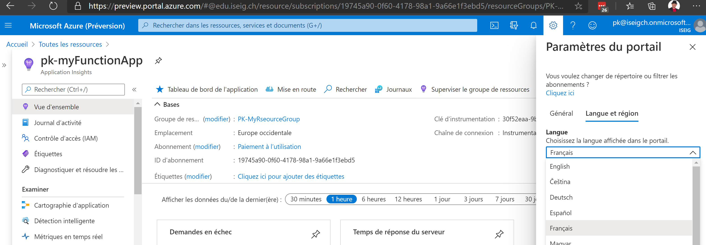

# AZ-204
## Prepare
### LABs
* download latest LABs docx to simplify. https://github.com/MicrosoftLearning/AZ-204-DevelopingSolutionsforMicrosoftAzure
  * lab_instructions, les 2 versions des guides
  * AK sont les versions plus détaillées
    * Aussi disponible "en ligne" sur Github en format Markdown
    * https://github.com/MicrosoftLearning/AZ-204-DevelopingSolutionsforMicrosoftAzure/tree/master/Instructions/Labs
* Install Visual Studio code, sur le poste client
  * https://code.visualstudio.com/docs/?dv=win
  * https://code.visualstudio.com/Download
  
### Files
* And get all LAB materials, about 30MB: https://github.com/MicrosoftLearning/AZ-204-DevelopingSolutionsforMicrosoftAzure/releases/tag/v20200909.01
  * allfiles comprend le source code requis pour les labs
  * AZ-204-DevelopingSolutionsforMicrosoftAzure = inutile, même contenu que les 2 autres, en 1 fois.
 
### Client
* Azure with subscription: http://portal.azure.com
   * login <prenom>.<nom>@edu.iseig.ch pour l'école ISEIG
   * Aussi possible: http://preview.portal.azure.com
 
 Penser à changer de langue pour passer en anglais: engrenage > Langue et région (2nd onglet du la "lame" des paramètres du portal)
 
 
 
* desktop/laptop + local admin to install Azure tools
  * https://docs.microsoft.com/en-us/powershell/azure/install-az-ps?view=azps-4.7.0
  * not support having both the AzureRM and Az modules installed for PowerShell 5.1 on Windows at the same time. 
    * install the Az module for PowerShell 6.2.4 or later.
    

## addon
### Statuts Ref URL
* https://status.azure.com/fr-fr/status


### Articles (famous)
* https://azure.microsoft.com/en-us/product-categories/developer-tools/
* https://medium.com/faun/remote-development-with-vs-code-and-azure-enhanced-productivity-with-best-of-both-worlds-994eb6bbc6fd
* TK

### Exam + online training
* https://docs.microsoft.com/en-us/learn/certifications/exams/az-204
* doc Azure: FR https://docs.microsoft.com/fr-fr/azure/?product=featured
  * accessible en Github (? non testé)

# LABs running
## Module 0 Course introduction


## Module 1 Creating Azure App Service Web Apps
### LAB 
https://microsoftlearning.github.io/AZ-204-DevelopingSolutionsforMicrosoftAzure/Instructions/Labs/AZ-204_01_lab.html
### REF DOC
https://azure.microsoft.com/fr-fr/pricing/details/app-service/windows/
* https://docs.microsoft.com/fr-fr/azure/app-service/overview-hosting-plans
* https://azure.microsoft.com/fr-fr/pricing/details/app-service/windows/

## Module 2 Implement Azure functions
### Lab

* https://microsoftlearning.github.io/AZ-204-DevelopingSolutionsforMicrosoftAzure/Instructions/Labs/AZ-204_02_lab.html

### REF DOC
* https://docs.microsoft.com/en-us/azure/azure-functions/durable/durable-functions-versions

## Module 3 Develop solutions that use blob storage
### requis
* .Net pour Visual Studio: https://dotnet.microsoft.com/download/dotnet-framework/thank-you/net48-developer-pack-offline-installer
  * raté pas l'air de foncitonner
* https://code.visualstudio.com/docs/languages/dotnet ?
  * https://dotnet.microsoft.com/download/dotnet-core/thank-you/sdk-3.1.402-windows-x64-installer
  * Il faut quitter et relancer Visual Studio code avant
* Tu peux récupérer les codes ici: https://github.com/MicrosoftLearning/AZ-204-DevelopingSolutionsforMicrosoftAzure/tree/master/Allfiles/Labs/03/Solution/BlobManager


## Module 4 Develop solutions that use Cosmos DB storage
Best: Faire la démo Cosmo DB du support Microsoft.
### FAQ
* [Optimizing performance and managing costs with Azure Cosmos DB, Best practices for new customers and workloads](https://github.com/CloudReady-ch/ISEIG-LAB/blob/master/AZ-204/Azure%20Cosmos%20DB%20onboarding%20best%20practices.pdf)
### Ref
* http://azurecosmosdb.com/
### lab
https://microsoftlearning.github.io/AZ-204-DevelopingSolutionsforMicrosoftAzure/Instructions/Labs/AZ-204_04_lab_ak.html
* Sample code in lab
```
using System;
using AdventureWorks.Context;
using AdventureWorks.Models;
using Microsoft.Azure.Cosmos;
using Microsoft.EntityFrameworkCore;
using System.Collections.Generic;
using System.Linq;
using System.Threading.Tasks;

public class Program
{
    private const string sqlDBConnectionString = "Server=tcp:polysqlsrvrpk.database.windows.net,1433;Initial Catalog=AdventureWorks;Persist Security Info=False;User ID=testuser;Password=TestPa55w.rd;MultipleActiveResultSets=False;Encrypt=True;TrustServerCertificate=False;Connection Timeout=30;";
    private const string cosmosDBConnectionString = "AccountEndpoint=https://polycosmospk.documents.azure.com:443/;AccountKey=50m1tAEfX4FoqiehWaoVrEweDqCjawmebIsZHNzfUqGuMF4RFXLYSA7tfeEeeP6O5A6K1mpLdFrBrLw2Zj89Kg==;";
        
    public static async Task Main(string[] args)
    {
        await Console.Out.WriteLineAsync("Start Migration");
        using AdventureWorksSqlContext context = new AdventureWorksSqlContext(sqlDBConnectionString);
        List<Model> items = await context.Models
    .Include(m => m.Products)
    .ToListAsync<Model>();
    await Console.Out.WriteLineAsync($"Total Azure SQL DB Records: {items.Count}");
    using CosmosClient client = new CosmosClient(cosmosDBConnectionString);
    Database database = await client.CreateDatabaseIfNotExistsAsync("Retail");
    Container container = await database.CreateContainerIfNotExistsAsync("Online",
        partitionKeyPath: $"/{nameof(Model.Category)}",
        throughput: 1000);
    int count = 0;
    foreach (var item in items)
        {
            ItemResponse<Model> document = await container.UpsertItemAsync<Model>(item);
            await Console.Out.WriteLineAsync($"Upserted document #{++count:000} [Activity Id: {document.ActivityId}]");
        }
    await Console.Out.WriteLineAsync($"Total Azure Cosmos DB Documents: {count}");
    }
}
```
### pricing Comso DB
* https://azure.microsoft.com/en-us/pricing/details/cosmos-db/
* https://cosmos.azure.com/capacitycalculator/
### ref doc
* https://docs.microsoft.com/fr-fr/azure/cosmos-db/
* https://docs.microsoft.com/fr-fr/azure/cosmos-db/provision-throughput-autoscale
* https://docs.microsoft.com/fr-fr/azure/cosmos-db/partitioning-overview
  * https://docs.microsoft.com/fr-fr/azure/cosmos-db/synthetic-partition-keys

## Module 5 Implement IaaS solutions
### demo correction - Creating an Azure VM by using PowerShell
```
$myResourceGroup = Read-Host -prompt "Enter a resource group name: "
 Enter a resource group name: 
$myLocation = Read-Host -prompt "Enter a location (ie. WestEurope): "
 Enter a location (ie. WestEurope): 
$myVM = Read-Host -prompt "Enter a VM name (max 15 car, avoid special car): "
 Enter a VM name (max 15 car, avoid special car):
$cred = (get-credential)
 user:
 password:
New-AzResourceGroup -Name $myResourceGroup -Location $myLocation 
new-azvm -ResourceGroupName $myResourceGroup -Name lab05-vm1-pk -Location $myLocation -Credential $cred
```
## Module 6 Implement user authentication and authorization


## Module 7 Implement secure cloud solutions


## Module 8 Implement API Management


## Module 9 Develop App Service Logic Apps


## Module 10 Develop event-based solutions


## Module 11 Develop message-based solutions


## Module 12 Monitor and optimize Azure solutions


## Module 13 Integrate caching and content delivery within solutions


# FAQ - Glossaire
* Bitbucket: Github Atlassian
* Blob: Binary Large Object: Type de stockage nouvelle génération (disque partagé++)
* Cosmo DB: Version propriétaire Microsoft de NoSQL - https://en.wikipedia.org/wiki/Cosmos_DB
* Handler mappings: custom script avec une URL spécifique et configuré dans Azure
* SCM: Software Component Management: https://support.ptc.com/help/thingworx_apps/r8.5/en/#page/thingworx_apps%2FThingWorxAppsSetupConfig%2Fsoftware_content_management.html
  * Ajouter scm dans l'url pour accéder au Kudu d'un Web App service https://github.com/projectkudu/kudu
  * https://<app-name>.scm.azurewebsites.net
  * https://pk-myfunctionapp.scm.azurewebsites.net/ aussi sur une function
* Zipdeploy

 
